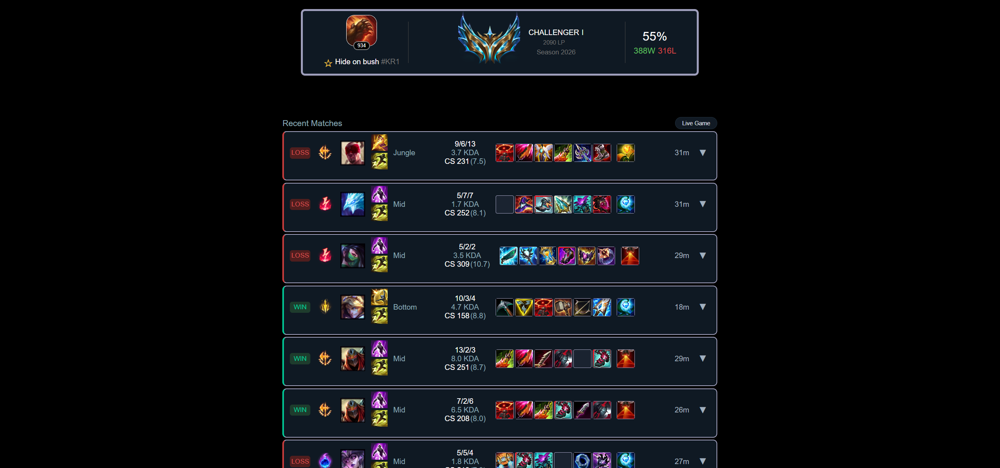
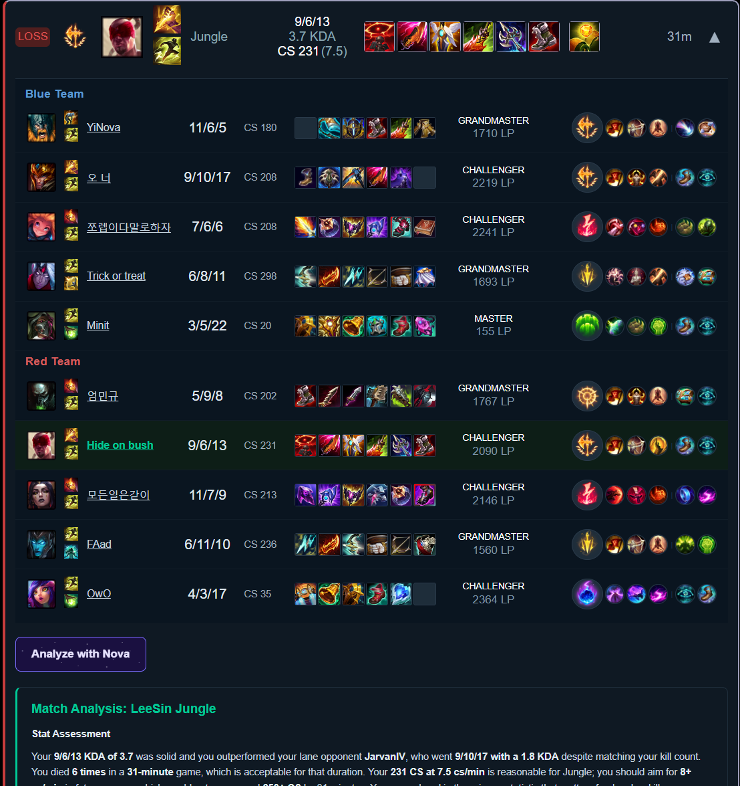
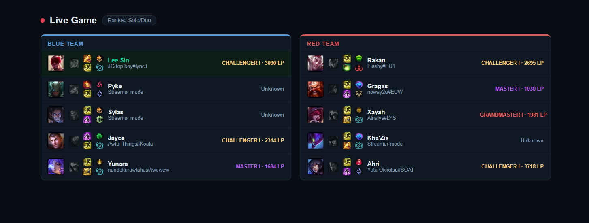
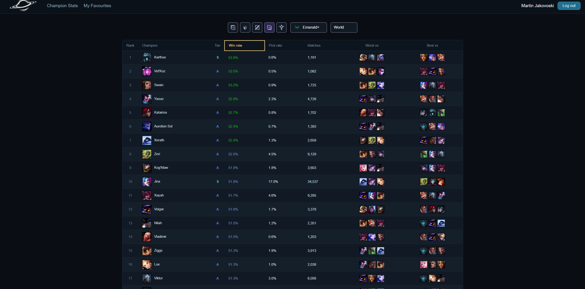

  

# Eclipse - League of Legends Stats App

A web app for looking up League of Legends summoner profiles and match history, similar to op.gg.

## Features

- **Summoner lookup:** rank, LP, winrate and the last 10 ranked games with items, runes and summoner spells
- **Match breakdown:** all 10 players with their ranks, KDA, CS and builds
- **Live game viewer:** both teams in a game happening right now, with bans, spells, keystones and ranks
- **Champion tier list:** win rate, pick rate and an S+ to D tier for every champion, filterable by role, rank and region
- **Nova:** AI analysis of any match, grounded in current-patch build data, powered by Anthropic Claude API
- **Accounts:** Google or email login, and a favourites list of summoners

## Tech Stack

- **Frontend:** React, Vite, React Router. Deployed on Vercel
- **Backend:** Node.js, Express. Deployed on Render
- **Data:** Riot Games API, Data Dragon (CDN)
- **Database and auth:** Supabase (PostgreSQL, Row Level Security, Google OAuth)

## Screenshots

**Summoner profile and match history**

**Match breakdown with player ranks and AI analysis**

**Live game**

**Champion tier list**

## Live Demo

https://eclipse.martinjakovoski.dev/

(The backend runs on a free Render instance, so the first request can take around 50 seconds while it wakes up.)

For anyone not familiar with League of Legends but still wishes to try the app:

- **Name:** Hide on bush
- **Tag:** KR1
- **Region:** Korea

## How to Run Locally

Several API keys needed, use the live link instead.

## Interesting problems

**Getting data that has no API.** Champion stats come from u.gg, which has no public API. I found the JSON endpoint the site uses internally through the browser's network tab. Cloudflare blocks those requests from a server, so the champion page fetches them directly from the browser.

**Decoding item icons.** u.gg's build pages are server-rendered and show items as tiles cut from one sprite sheet, with no item names or IDs in the HTML. Riot's Data Dragon stores the same sprite sheet and pixel offsets for every item, so matching the sprite file and offset identifies each item exactly, along with its stats and cost.

**Stopping the AI from making things up.** Early versions of Nova mentioned items the player never bought and got basic stats wrong. Most fixes were in the data rather than the prompt: the recommended build is sent as an unordered set so the model stops inventing a build order, stats like KDA are calculated before they reach the model, and every field it may use is named explicitly.

**Caching ranks within Riot's rate limit.** Showing ranks for all 10 players costs 10 API calls against a limit of 100 per 2 minutes. Ranks are cached in Postgres for 6 hours and fetched only when missing or stale. A cached request takes 0.05s instead of 0.36s and makes no API calls. Failed lookups are never cached, so a rate-limit error is not saved as "unranked".

**Security.** Row Level Security is enabled on every table, and the service key only exists on the backend. The Express auth middleware is hand-written and verifies the Supabase JWT on each protected request.

**Live game edge cases.** Streamer mode hides some players' names and IDs, so those show as unknown instead of breaking the page. Each ban is matched to the player who made it.
